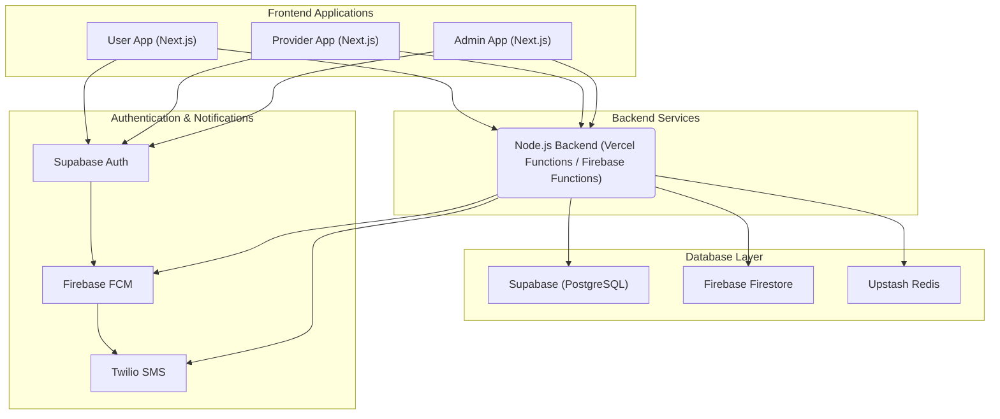

# Implementation Plan - Global Home Services Marketplace

## Section 1: Project Overview
This document outlines the implementation plan for a global home services marketplace platform, designed to connect customers with service providers. The platform will initially consist of three web applications:
1.  **User-side web application:** For customers to browse, book, and manage services.
2.  **Service Provider-side web application:** For professionals to manage jobs, availability, and earnings.
3.  **Admin Panel web application:** For administrators to oversee and manage the entire platform operations.

The initial scope (V1) will focus on a manual admin assignment model for service requests, built with a "Zero-Cost MVP" mindset for the first 1-2 months, leveraging free tiers and a Node.js backend.

## Section 2: Development Phases

### Phase 0 - Foundation and Setup (Estimated: 1 month)

| Task ID | Task Name                                                     |
|---------|---------------------------------------------------------------|
| P0-01   | Initialize User-app Next.js project                           |
| P0-02   | Initialize Provider-app Next.js project                       |
| P0-03   | Initialize Admin-app Next.js project                          |
| P0-04   | Set up Node.js backend project structure (e.g., Express.js or Next.js API routes) |
| P0-05   | Configure Supabase project and run initial schema migrations  |
| P0-06   | Configure Firebase project, set up Firestore collections and security rules |
| P0-07   | Set up Upstash Redis instance                                 |
| P0-08   | Configure Google Cloud project (for Firebase Functions/Cloud Functions), enable Cloud Storage |
| P0-09   | Set up CI/CD pipelines (GitHub Actions) for all services, including Vercel/Netlify deployments |
| P0-10   | Set up environment variable management                        |
| P0-11   | Configure Twilio account and SMS templates                    |
| P0-12   | Set up shared component library and design system (Tailwind CSS + Shadcn/UI) |

### Phase 1 - Core Authentication and User Management (Estimated: 1 month)

| Task ID | Task Name                                                     |
|---------|---------------------------------------------------------------|
| P1-01   | Implement Supabase Auth for User App (email/password + phone OTP) |
| P1-02   | Implement Supabase Auth for Provider App (email/password + phone OTP) |
| P1-03   | Implement Supabase Auth for Admin App (email/password + phone OTP) |
| P1-04   | Build user registration and profile creation flow             |
| P1-05   | Build service provider registration and KYC document upload flow |
| P1-06   | Build admin login with role-based access control              |
| P1-07   | Implement JWT token validation in Node.js backend (e.g., middleware for Express.js or Next.js API routes)       |
| P1-08   | Set up Row Level Security (RLS) policies in Supabase          |
| P1-09   | Integrate Supabase Auth with Next.js applications             |
| P1-10   | Develop user profile management features                      |

### Phase 2 - Service Catalog and Booking Engine (Estimated: 1 month)

| Task ID | Task Name                                                     |
|---------|---------------------------------------------------------------|
| P2-01   | Build service categories and listing pages (User App)         |
| P2-02   | Implement service search and filtering (User App)             |
| P2-03   | Build booking creation flow (select service, date/time, address, payment) |
| P2-04   | Implement payment gateway integration (Stripe for international) |

| P2-06   | Build booking management views for User App                   |
| P2-07   | Build booking management views for Provider App               |
| P2-08   | Build booking management views for Admin App                  |
| P2-09   | Implement promo code system                                   |
| P2-10   | Build address management with Google Maps API integration     |
| P2-11   | Develop service detail pages with pricing and descriptions    |
| P2-12   | Integrate booking data with Supabase                          |

### Phase 3 - Admin Assignment Engine (V1 Core Feature) (Estimated: 1 month)

| Task ID | Task Name                                                     |
|---------|---------------------------------------------------------------|
| P3-01   | Build admin booking management dashboard with advanced filtering |
| P3-02   | Build provider availability and status view for admins        |
| P3-03   | Implement manual provider assignment flow in admin panel      |
| P3-04   | Implement notification system: send assignment notifications to user via FCM |
| P3-05   | Implement notification system: send assignment notifications to provider via FCM |
| P3-06   | Implement notification system: send assignment notifications to user via SMS (Twilio) |
| P3-07   | Implement notification system: send assignment notifications to provider via SMS (Twilio) |
| P3-08   | Implement booking status lifecycle management (pending, assigned, in-progress, completed, cancelled) |
| P3-09   | Develop API endpoints for assignment operations in Node.js backend |
| P3-10   | Update Supabase schema for assignment tracking                |

### Phase 4 - Provider Job Management (Estimated: 1 month)

| Task ID | Task Name                                                     |
|---------|---------------------------------------------------------------|
| P4-01   | Build provider dashboard with assigned jobs list              |
| P4-02   | Implement job accept/decline flow                             |
| P4-03   | Build in-app navigation integration (Google Maps deep link)   |
| P4-04   | Implement job start action with timestamp recording           |
| P4-05   | Implement job complete action with timestamp recording        |
| P4-06   | Build provider availability calendar management               |
| P4-07   | Implement earnings dashboard for providers                    |
| P4-08   | Implement payout tracking for providers                       |
| P4-09   | Develop API endpoints for job status updates in Node.js backend    |
| P4-10   | Integrate provider job data with Supabase                     |

### Phase 5 - Real-time Features (Estimated: 1 month)

| Task ID | Task Name                                                     |
|---------|---------------------------------------------------------------|
| P5-01   | Implement Firebase Firestore real-time chat between user and provider | TBD      | Not Started   | High     |       |
| P5-02   | Implement real-time provider location tracking using Firebase Realtime Database | TBD      | Not Started   | High     |       |
| P5-03   | Build live booking status updates using Firestore listeners   | TBD      | Not Started   | High     |       |
| P5-04   | Implement push notifications via FCM for all key events       | TBD      | Not Started   | High     |       |
| P5-05   | Build in-app notification center                              | TBD      | Not Started   | Medium   |       |
| P5-06   | Develop Firebase security rules for chat and location data    | TBD      | Not Started   | High     |       |
| P5-07   | Integrate Firebase SDKs into Next.js applications             | TBD      | Not Started   | High     |       |
| P5-08   | Develop backend services for chat history and location data processing | TBD      | Not Started   | Medium   |       |

### Phase 6 - Reviews, Disputes, and Reporting & Launch Preparation (Estimated: 1 month)

| Task ID | Task Name                                                     |
|---------|---------------------------------------------------------------|
| P6-01   | Build post-service rating and review system                   |
| P6-02   | Implement dispute creation and management flow                |
| P6-03   | Build admin dispute resolution interface with chat log access |
| P6-04   | Build analytics dashboard for admin (GMV, bookings, user growth, provider performance) |
| P6-05   | Implement financial reporting for admin                       |
| P6-06   | Implement payout management for admin                         |
| P6-07   | Develop API endpoints for reviews and disputes in Node.js backend  |
| P6-08   | Integrate analytics tools (e.g., Google Analytics, custom dashboards) |
| P6-09   | Design database schema for reviews and disputes in Supabase   |
| P6-10   | Implement reporting data aggregation logic                    |

| Task ID | Task Name                                                     |
|---------|---------------------------------------------------------------|
| P7-01   | Unit testing for Node.js backend services                          |
| P7-02   | Integration testing for booking and payment flows             |
| P7-03   | End-to-end testing for critical user journeys                 |
| P7-04   | Performance testing and load testing                          |
| P7-05   | Security audit (RLS policies, API authentication, data validation) |
| P7-06   | Staging environment deployment and UAT                        |
| P7-07   | Production deployment and go-live checklist                   |
| P7-08   | Prepare rollback plan                                         |
| P7-09   | Finalize monitoring and alerting setup                        |
| P7-10   | Conduct user acceptance testing (UAT) with stakeholders       |

## Section 3: Technical Architecture Diagram (text-based)

## Section 4: Key Technical Decisions and Rationale

| Technology            | Decision      | Rationale                                                              |
|-----------------------|---------------|------------------------------------------------------------------------|
| **Frontend**          | Next.js 14+   | SSR/SSG for performance, shared components, easy API routes (BFF), mobile path. |
| **Backend**           | Node.js       | Faster development, unified language (JS/TS), good for MVP, scalable via serverless functions. |
| **Primary Database**  | Supabase      | PostgreSQL for relational data, built-in Auth, RLS, real-time capabilities. |
| **Real-time Data**    | Firebase Firestore | Real-time sync for chat, location, status updates.                   |
| **Caching/Queue**     | Upstash Redis | High-performance caching, rate limiting, job queuing.                  |
| **Cloud Platform**    | Google Cloud  | Robust, scalable infrastructure, integrates well with Firebase.        |
| **Backend Hosting**   | Vercel/Firebase | Serverless functions, auto-scaling for Node.js backend, free-tier friendly.                    |
| **Storage**           | Cloud Storage | Scalable object storage for media files.                               |
| **Event Bus**         | Pub/Sub       | Asynchronous, event-driven communication for microservices.            |
| **SMS Provider**      | Twilio        | Global reach and reliability for critical notifications.               |
| **SMS (India)**       | MSG91         | Cost-effective and DLT compliant for India-specific deployments.       |
| **Authentication**    | Supabase Auth | Integrated auth solution with email/password, OTP, social login.       |
| **Push Notifications**| Firebase FCM  | Cross-platform push notifications for web and mobile.                  |
| **Future Mobile**     | React Native (Expo) | Code reuse with Next.js, leverages existing backend/database.          |

## Section 5: Risk Register

| Risk ID | Risk                                                      | Mitigation Strategy                                                              |
|---------|-----------------------------------------------------------|----------------------------------------------------------------------------------|
| R-01    | Real-time location tracking performance at scale          | Use Firebase Realtime Database with connection pooling and data pruning strategies. |
| R-02    | Payment gateway failures                                  | Implement idempotent payment processing with retry logic and webhook verification. |
| R-03    | Provider no-show after assignment                         | V1 admin monitoring; V2 automated reassignment logic.                            |
| R-04    | Data consistency between Supabase and Firebase            | Use event-driven sync via Cloud Pub/Sub with idempotent handlers.                |
| R-05    | SMS delivery failures in new markets                      | Implement fallback from Twilio to local providers per country.                   |
| R-06    | Security vulnerabilities in API endpoints                 | Regular security audits, input validation, rate limiting, and WAF.               |
| R-07    | Scalability bottlenecks in Node.js backend                     | Implement robust load testing, performance monitoring, and optimize critical paths. Consider migrating to Go backend for extreme scale if needed. |
| R-08    | High operational costs for cloud services                 | Implement cost monitoring, optimize resource usage, and leverage serverless options. |
| R-09    | Integration complexities between diverse tech stack       | Thorough documentation, clear API contracts, and dedicated integration testing.  |
| R-10    | Lack of skilled resources for specific technologies       | Cross-training, hiring specialized talent, or leveraging external consultants.   |
