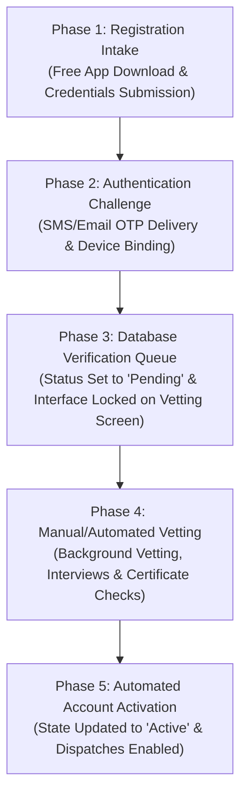
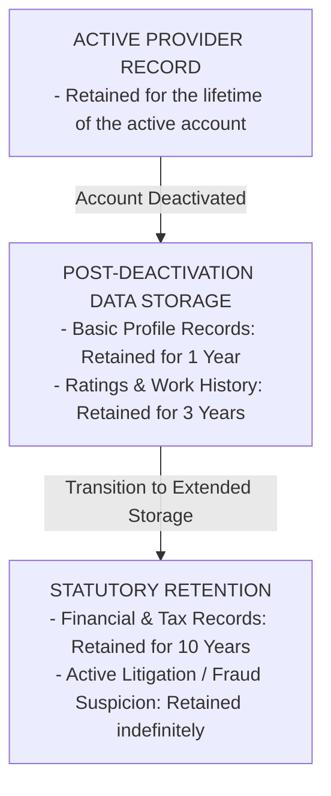
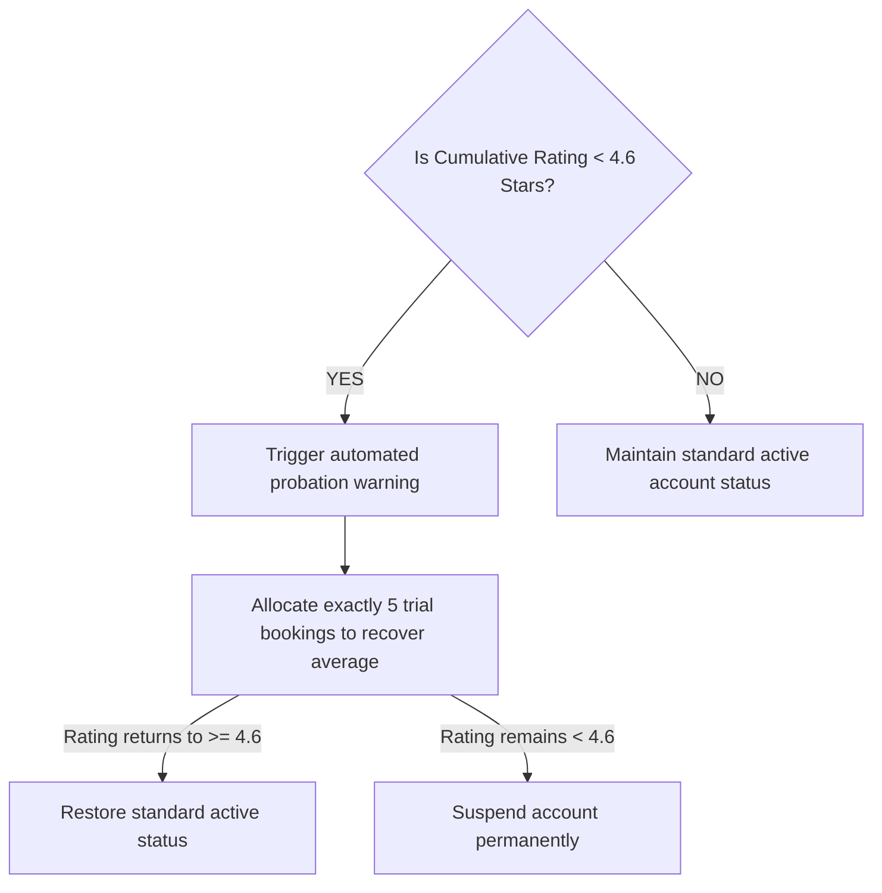

# Strategic Blueprint for an On-Demand Home Services Platform

This blueprint outlines the comprehensive onboarding, authentication, and verification workflows of **Oscar App Limited**, analyzing corporate origin, operational setup, regulatory standards, data lifecycle schemas, and technical trade-offs for developers launching a localized home services marketplace in the United Kingdom.

---

## 1. Corporate Origin and Market Entry Context

Developing an on-demand, high-density marketplace for home services within the United Kingdom requires a clear understanding of both localized statutory frameworks and the software architecture utilized by successful market participants. A primary benchmark in this sector is **Oscar**, operated in the United Kingdom by **Oscar App Limited** (Company No. 16336226), registered at *3rd Floor, 1 Ashley Road, Altrincham, Cheshire, WA14 2DT*. The parent entity, **Routinedisplay, S.A.** (Company No. 515705950), operates from Braga, Portugal, providing a consolidated operational blueprint across continental Europe and the British Isles.

The platform relies on a city-by-city density model, establishing concentrated localized networks of service providers in major urban centers such as London, Lisbon, and Oporto before expanding outward. For developers aiming to launch a similar platform in the United Kingdom, replicating this localized strategy is highly practical.

During its market expansion phase, such as the pre-launch campaign in Liverpool, the platform utilized a time-sensitive, cost-free registration window to build supply-side capacity before launching the consumer-facing application. Providing early-bird incentives and dedicated setup assistance helps attract independent service professionals, building the necessary supply density to support a real-time, 30-minute booking dispatch system.

---

## 2. The Service Professional Onboarding Lifecycle

The onboarding funnel of the "Oscar Professional" mobile application is designed to balance user acquisition with rigorous credential verification. The transition from an applicant to an active partner is managed through a structured, multi-stage workflow:

*   **Registration Intake:** Upon downloading the free application, the professional enters an ingestion sequence, submitting identity documents, tax registrations, and banking credentials.
*   **Vetting Hold:** Once these forms are complete, the applicant is placed in a verification queue, and the application displays a locked screen stating that the profile is awaiting activation.
*   **Operations Review SLA:** The platform's standard service level agreement (SLA) for profile review is 48 hours. During this window, administrators run identity checks, verify qualifications, and conduct interviews. 
*   **Resolution:** If the application contains errors or lacks required documents, the profile remains locked, and the system prompts the applicant to submit corrected information via support channels. Once approved, the account status changes to active, allowing the provider to receive automated job assignments.

---

## 3. Data and Documentation Ingestion Schema

The platform's databases must be configured to collect, process, and securely store sensitive personal, tax, and professional details. This data must align with the UK General Data Protection Regulation (UK GDPR) and the Data Protection Act 2018.

### 3.1. Core Personal, Identity, and Tax Records
These fields map directly to user identities, matching definitions like those in [profiles](file:///D:/Ganesh/work/Urban-assist/supabase/migrations/0001_schema.sql#L27) schema:

| Data Category | Technical Database Field | Specific Requirements & Formatting | Legal or Operational Purpose |
| :--- | :--- | :--- | :--- |
| **Legal Identity** | `legal_first_name`, `legal_last_name` | String format matching government-issued ID. | Required for background checks and contractual verification. |
| **Contact Markers** | `mobile_phone_number`, `email_address` | E.164 phone format; validated email string. | Used as authentication factors and primary notification channels. |
| **Business Address** | `business_street_address`, `postcode` | Validated UK postal address. | Defines the provider's default operating zone and tax location. |
| **Taxpayer Identifiers** | `national_insurance_number` (NINO) | Format: `QQ123456C` (individuals). | Mandated for HMRC self-employment reporting and verification. |
| **Corporate Credentials** | `company_registration_number` (CRN) | 8-character string for incorporated business entities. | Required if registering as a limited company in the UK. |
| **Banking Destination** | `bank_sort_code`, `account_number` | 6-digit sort code; 8-digit UK account number or valid IBAN. | Destination for daily automated payments via Stripe Payments UK. |

### 3.2. Visual, Geographic, and Professional Verification Assets

*   **Profile Photographs:** Applicants must upload a clear headshot. This image is processed by automated image filters and artificial intelligence algorithms to adjust brightness, contrast, and sizing, ensuring a uniform, professional appearance across the customer-facing app.
*   **Real-Time Telemetry and Geolocation:** Providing on-demand services requires continuous background and foreground GPS tracking (stored in entities like [provider_location](file:///D:/Ganesh/work/Urban-assist/supabase/migrations/0001_schema.sql#L118)). Service professionals must grant persistent geolocation permissions. Telemetry is tracked when the application runs in the foreground or during an active job, feeding the matching algorithms and real-time customer tracking maps.
*   **Specialized Trade Certifications:** For specialized tasks, the platform blocks registration until the provider uploads valid, verified certifications (configured in [provider_documents](file:///D:/Ganesh/work/Urban-assist/supabase/migrations/0001_schema.sql#L109)):

| Specialized Category | Mandatory Documentation & Registry Checks | UK Regulatory Standards |
| :--- | :--- | :--- |
| **Gas & Boiler Engineering** | Active registration card on the Gas Safe Register. | Gas Safety (Installation and Use) Regulations 1998. |
| **Electrical Installations** | Electrotechnical Certification Scheme (ECS) card or NICEIC accreditation. | BS 7671 (IET Wiring Regulations) and Part P of the Building Regulations. |
| **HVAC & Refrigeration** | Valid F-Gas Certification card. | Fluorinated Greenhouse Gases Regulations 2015. |
| **General Construction** | Public Liability Insurance certificate with a minimum coverage limit (e.g., £1M to £5M). | Protects the platform and consumers against accidental damage. |

---

## 4. Technical Execution of the Registration and Login Flow

The software architecture of the onboarding system should minimize friction while enforcing data validation rules.

### 4.1. Detailed Account Registration and Verification Sequence

| Phase | User-Side Interaction (Mobile Client) | Backend System Action (Platform Engine) | Security & Protocol Standards |
| :--- | :--- | :--- | :--- |
| **1. Ingestion** | The user downloads the "Oscar Professional" app and selects "Sign Up". | Registers device signatures and initializes a pending database record. | HTTPS/TLS 1.3 protocol; capture of basic device fingerprints. |
| **2. Auth Challenge** | The user inputs their mobile phone number or registered email address. | Generates a cryptographically secure 6-digit verification code. | Dispatched via SMS Gateway (e.g., Twilio) or SMTP. See [otpRateLimit](file:///D:/Ganesh/work/Urban-assist/packages/integrations/src/redis/client.ts#L62). |
| **3. Verification** | The user enters the received verification code within a set expiration window. | Validates the token and updates the profile state to "Authenticated". | Rate-limits verification attempts to prevent brute-force attacks. |
| **4. Document Upload** | The user fills out profile details and uploads identity and trade documents. | Saves file attachments to encrypted, access-controlled storage. | Restricted access via AWS S3 using presigned URLs and KMS encryption. |
| **5. Verification Queue** | The user sees a locked "Waiting for Activation" screen. | Triggers alerts for manual review and runs automated compliance checks. See [kyc/page.tsx](file:///D:/Ganesh/work/Urban-assist/apps/admin/app/(app)/kyc/page.tsx). | Isolates the user role, blocking job-matching features. |
| **6. Account Activation** | The user receives a push notification and email confirmation of approval. | Changes the account status flag from "Pending" to "Active" ([kyc_status](file:///D:/Ganesh/work/Urban-assist/supabase/migrations/0001_schema.sql#L34)). | Updates authorization permissions, allowing the user to go online. |

### 4.2. Persistent Authentication and Active Session Security
Once an account is verified, the login process uses persistent, token-based authentication (OAuth 2.0 or JSON Web Tokens) to secure the active session. This setup allows professionals to open the app and access features without entering credentials repeatedly, using background validation checks instead.

To verify logins, the system requires an SMS-based verification code sent to the registered mobile number. The backend ties these sessions to unique hardware identifiers, preventing unauthorized account sharing across multiple devices. If security policies flag a device change or suspicious activity, the system triggers a multi-factor authentication check to confirm the user's identity before restoring full account access.

---

## 5. Legal Framework, Risk Management, and Operational Security

Operating a digital home services marketplace in the United Kingdom requires a clear legal strategy to manage liabilities and comply with local regulations.

### 5.1. Standard Contractual Classification
To minimize direct employment liability under UK labor laws, the platform must establish a clear business-to-business (B2B) contractor relationship with its service providers. The platform acts as a commercial intermediary that facilitates electronic bookings, leaving the direct service contract to be formed between the service professional and the customer upon booking confirmation.

Service professionals are classified as independent contractors rather than employees. They retain complete control over their working hours and must provide their own tools, materials, transport, and safety equipment.

### 5.2. Ground-Level Identity Verification and Refund Liability
To reduce the risk of billing fraud or safety incidents, the platform requires service professionals to perform a physical identity check upon arrival. Before starting any work, the provider must verify the customer's identity at the specified address.

If a provider performs a service for the wrong customer due to a failure to confirm identity details, the platform refunds the customer and withholds payment from the service provider, who must absorb any associated labor and material costs.

### 5.3. Strict Customer Data Isolation Policies
Under UK GDPR, service professionals are strictly prohibited from storing, exporting, or directly processing customer personal data for their own use. To prevent off-platform transaction leakage and maintain data privacy:

*   All communications, including customer phone calls and messages, are routed through anonymized voice-proxy networks and in-app chat systems, hiding the customer’s actual phone number.
*   Service providers may only use client details to perform the requested service. They are prohibited from contacting clients directly outside the app, requesting direct contact information, or using client data for external purposes.
*   Any violation of these data boundaries results in immediate account suspension, platform termination, and potential liability for corporate damages.

### 5.4. Data Retention Schedules for UK Compliance

When an account is deactivated, basic profile records are held for **one year** to prevent immediate re-registration and bypass safety reviews. Financial ledger records, VAT statements, and tax-relevant transaction details are stored for **ten years** from the date of the last transaction to satisfy statutory audit requirements.

Ratings, feedback metrics, and job histories are kept for **three years** before being permanently anonymized. If an account is flagged for fraud, criminal investigation, or active litigation, the associated data is retained until the relevant statutory limitation period expires or a binding legal judgment is reached.

---

## 6. Algorithmic Quality Control and Termination Thresholds

Maintaining platform standards requires a combination of customer feedback loops, performance benchmarks, and clear service warranties.

### 6.1. The 4.6-Star Performance Threshold and Suspension Logic
The platform monitors performance using customer feedback and ratings, which are linked to the provider's account. If a provider's rolling rating average drops below the minimum threshold of **4.6 stars** out of 5.0, the platform triggers an automated compliance review:

During this probationary window, the system monitors the next five customer ratings. If the average rating returns to 4.6 or higher, standard status is restored. If the rating remains below 4.6 after the five trial bookings, the account is suspended or terminated. In the codebase, this triggers calculations linked to [recompute_rating](file:///D:/Ganesh/work/Urban-assist/supabase/migrations/0003_triggers.sql#L24) logic.

### 6.2. The 15-Day Service Guarantee and Financial Liability
To build consumer confidence in the UK market, all bookings include a **15-day service guarantee**. If a customer files a complaint regarding service quality within 15 days of job completion, the platform triggers a service guarantee claim.

Under this guarantee, the original service provider is contractually required to return to the location and correct any validated issues at no additional cost to the customer. The provider must cover all labor and material expenses for the return visit.

If the provider refuses to perform the corrective work, the platform may dispatch an alternative professional, issue a full refund to the customer, and deduct the costs from the original provider’s balance or pending payouts.

---

## 7. Technical Trade-offs of Onboarding Architectures

A key decision for the development team is choosing between automated document-verification tools and manual verification procedures. Each approach has distinct trade-offs regarding onboarding speed, cost, and operational security.

| Parameter | Automated Verification Architecture (e.g., Stripe Identity, Onfido) | Manual Verification Architecture (In-House Admin Panel) |
| :--- | :--- | :--- |
| **Onboarding Velocity** | Highly efficient. Vetting completes within minutes of document submission. | Slower. Introduces a 24- to 48-hour delay due to manual queues. |
| **Integration Overhead** | High initial engineering cost. Requires API integration and webhook management. | Low technical complexity. Built using standard administrative dashboards. |
| **Operating Cost** | High recurring costs. Requires a per-verification API transaction fee. | Fixed operational cost. Tied directly to administrative staff hours. |
| **Fraud Detection** | High. Uses automated checks to identify tampered or synthetic documents. | Low. Relies on human review, which is more prone to missing document alterations. |
| **UK Trade Compliance** | Medium. Validates identity documents but struggles to verify UK specialized registers. | High. Administrators can manually verify credentials against the Gas Safe or ECS databases. |

By understanding these technical trade-offs, the development team can construct an onboarding system that balances speed and security, providing a reliable foundation for launching and scaling a competitive home services platform in the UK market.
